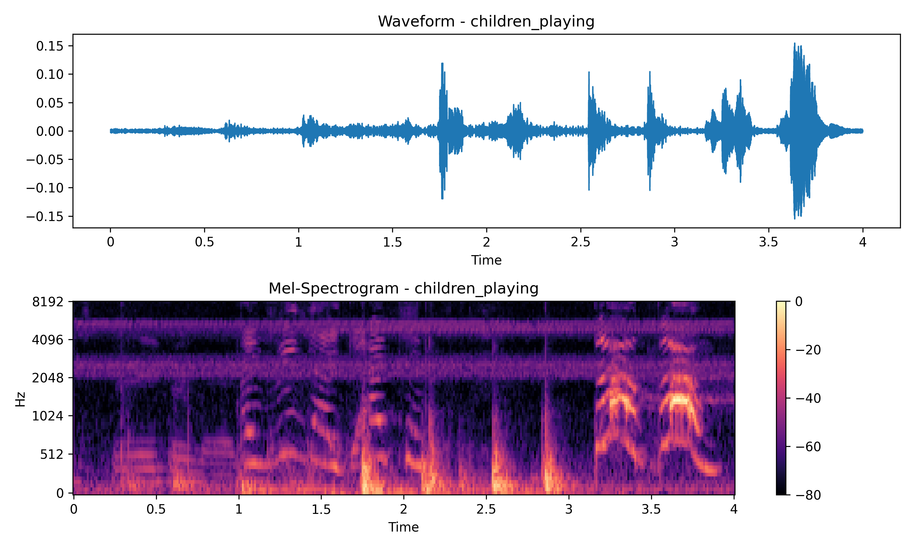
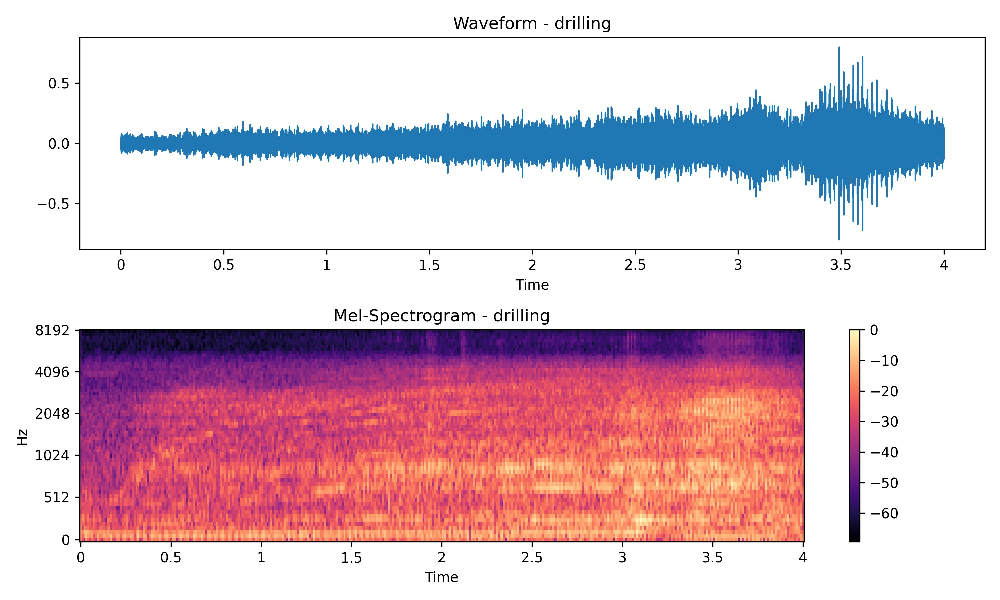
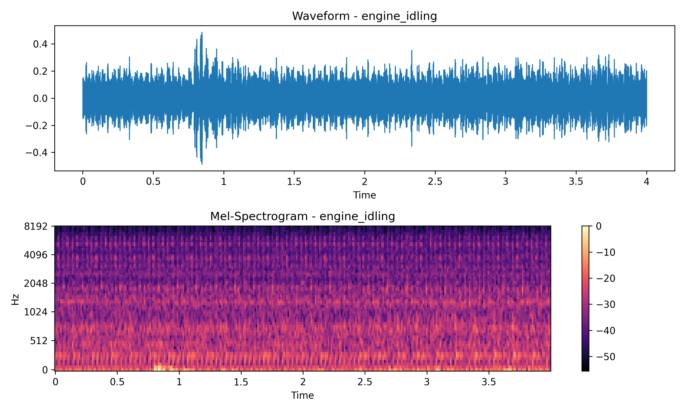
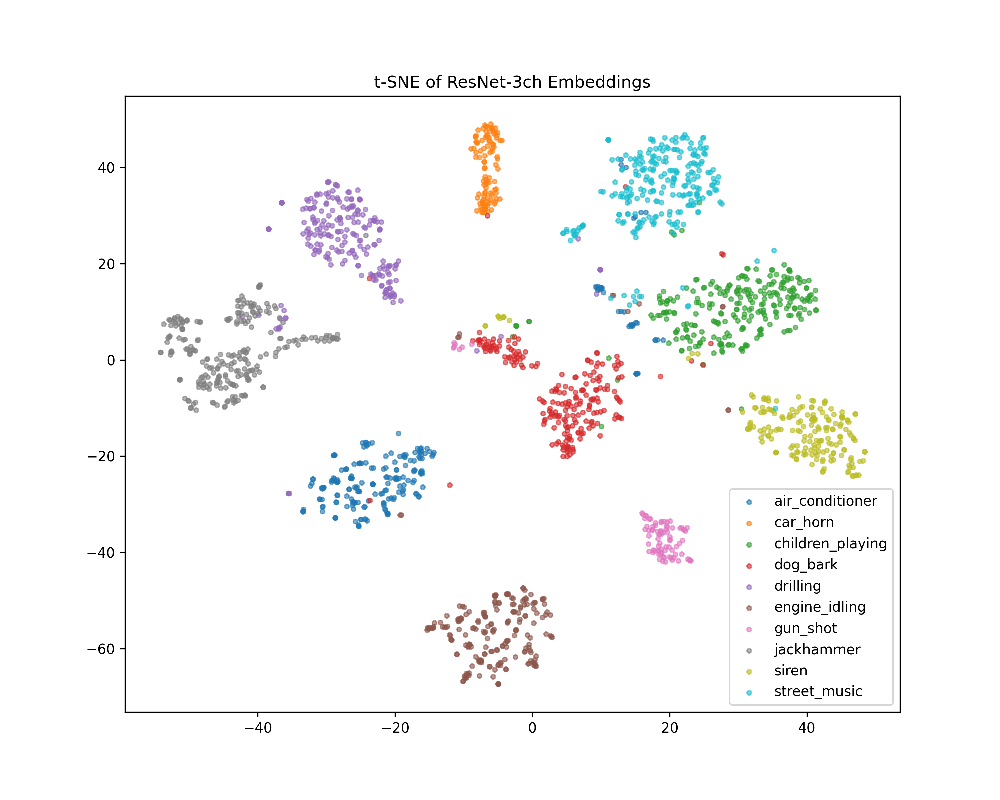
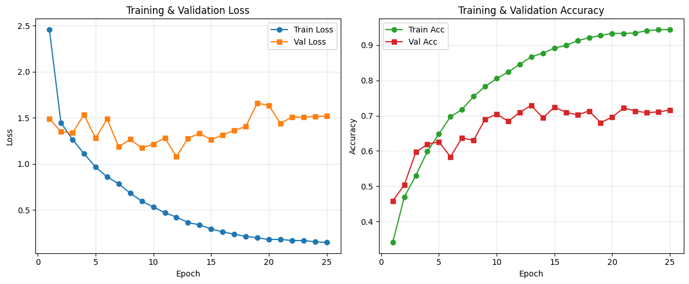
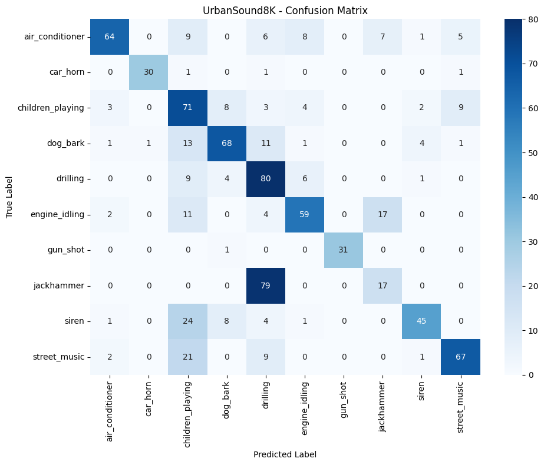
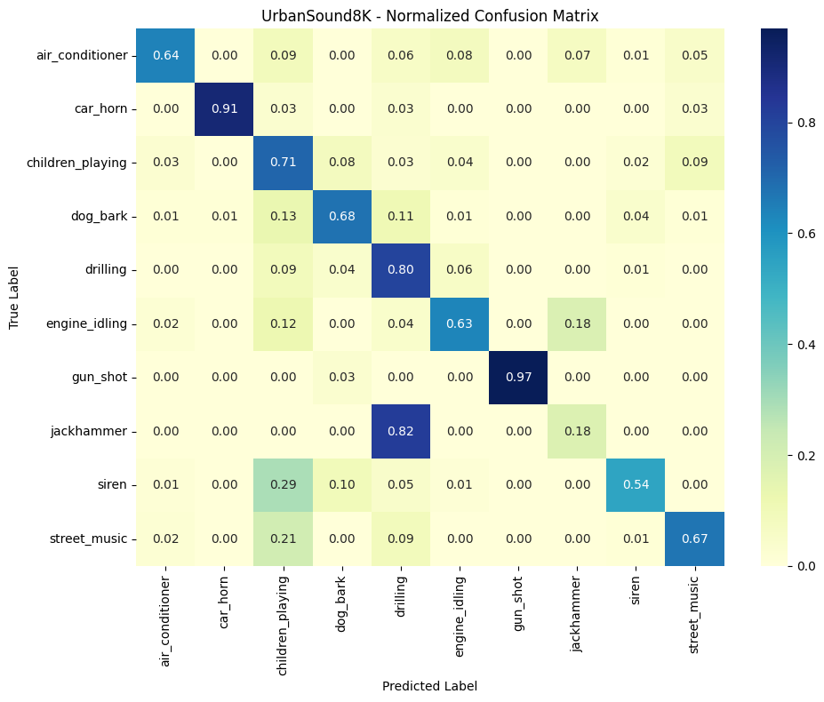
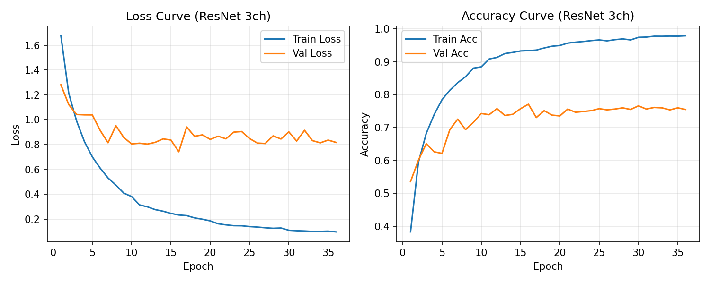
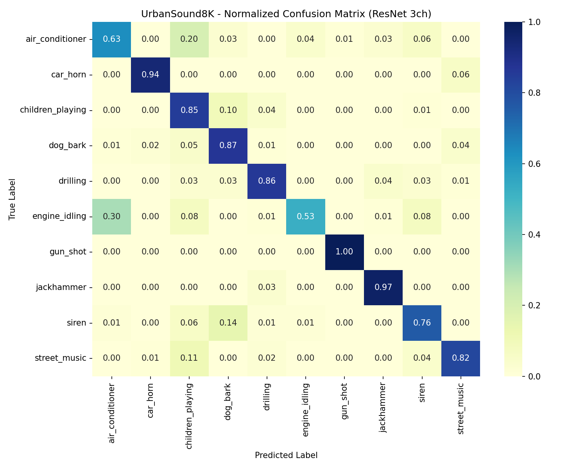
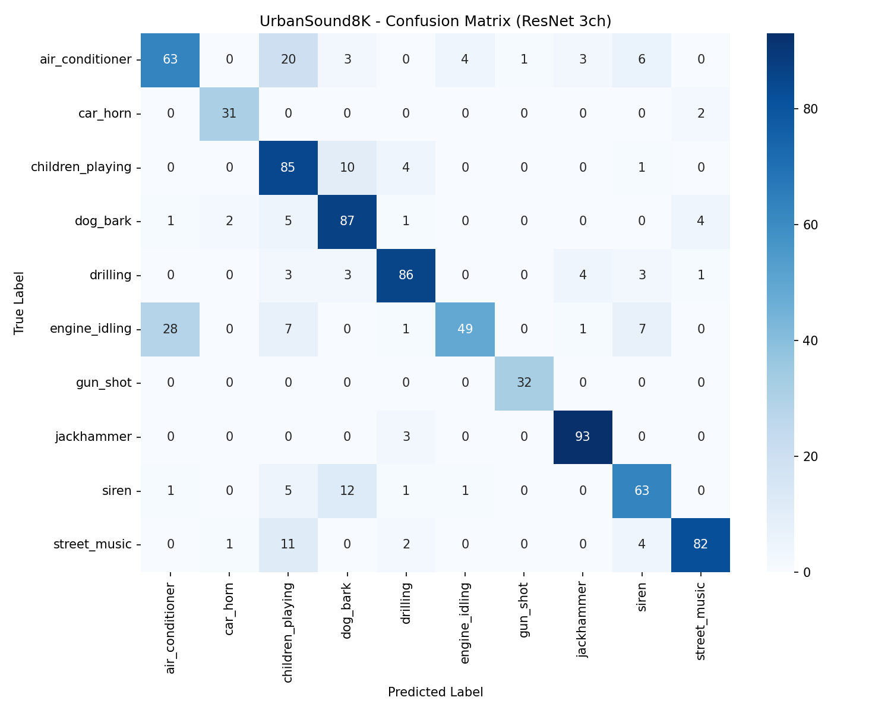

# CS506 Final Project — UrbanSound8K Audio Classification
**Author:** Xian Gong  
**Presentation Video:** *(Insert your 10-minute YouTube link here)*


## Project Overview
This project implements two end-to-end audio classification pipelines for the UrbanSound8K dataset:
1. A custom three-channel log-mel ResNet (PyTorch)
2. A transfer-learning pipeline using YAMNet embeddings + MLP classifier

The final system includes reproducible code, automated dataset download, interactive visualizations, testable modules, and CI integration through GitHub Actions.

---

# 1. How to Build and Run the Code 

This project includes a complete `Makefile` and pytest tests so that anyone can reproduce the full pipeline.

## 1.1 Recommended 

```
make install
make train_all
make extract_all
make viz_all
make test
```

## 1.2 Windows 

```
python -m pip install -r requirements.txt

python train_resnet_3ch.py
python train_yamnet_transfer.py

python extract_resnet_embeddings.py
python extract_yamnet_embeddings.py

python visualize_resnet_embeddings.py
python visualize_embeddings.py
python visualize_waveform_mel.py

pytest -q
```
## 1.3 Dataset and Download Instructions

The project uses the **UrbanSound8K** dataset.  
To ensure reproducibility, the dataset is downloaded automatically using:

```bash
python data/download.py
```

This script:
- Downloads the official UrbanSound8K archive  
- Verifies checksum  
- Extracts audio into `data/UrbanSound8K/audio/`  
- Places metadata into `data/UrbanSound8K/metadata/UrbanSound8K.csv`

All training and visualization scripts rely on these paths.

---

# 2. Project Structure

```
CS506-Final-Project/
│
├── train_resnet_3ch.py               # ResNet model training (3-channel mel input)
├── train_yamnet_transfer.py          # YAMNet transfer learning classifier
│
├── extract_resnet_embeddings.py
├── extract_yamnet_embeddings.py
│
├── visualize_resnet_embeddings.py    # PCA + t-SNE for ResNet features
├── visualize_embeddings.py           # PCA + t-SNE for YAMNet embeddings
├── visualize_waveform_mel.py         # Waveform + mel-spectrogram (interactive)
│
├── test_resnet_shapes.py
├── test_yamnet_transfer_shapes.py
│
├── requirements.txt
├── Makefile
└── README.md
```

---

# 3. Test Code & GitHub Workflow

We include minimal but meaningful unit tests to verify core functionality.

### Tests validate:
- Model forward pass  
- Correct output shapes  
- Absence of NaN/Inf  
- Independent of dataset access  

Run tests:

```
pytest -q
```

A GitHub Actions workflow may be added to automate:

- Dependency installation  
- pytest execution  

---

# 4. Visualizations of Data

The project implements all required visualizations, including interactive ones.

## 4.1 Waveform + Mel-Spectrogram 

Outputs:
- One sample from each of 10 UrbanSound8K classes
- Waveform visualizations  
- Mel-spectrogram visualizations 

 






## 4.2 YAMNet Embedding Visualization (PCA to t-SNE)
Script: `visualize_embeddings.py`
This pipeline:
- Loads YAMNet embeddings (1024-dim)
- Applies PCA → 50D
- Applies t-SNE → 2D
- Colors points by class

Static figure:


Interactive:
```
visualizations/tsne_yamnet_embeddings.html
```

## 4.3 ResNet Embedding Visualization
Script: `visualize_resnet_embeddings.py`
Extracts embeddings from the ResNet penultimate layer and performs PCA+t-SNE.

Static:




Interactive:
```
visualizations/tsne_resnet3ch_embeddings.html
```

---

# 5. Data Processing

### 5.1 Metadata Loading  
Parses `UrbanSound8K.csv` to extract paths, folds, and labels.

### 5.2 ResNet Audio Preprocessing  
- Load waveform  
- Compute 64-bin log-mel spectrogram  
- Compute delta and delta-delta  
- Stack into 3-channel tensor  
- Pad/crop to fixed length  

### 5.3 YAMNet Embedding Extraction  
- Load pretrained YAMNet from TensorFlow Hub  
- Extract 1024-dimensional embeddings  
- Average-pool over frames  
- Save as `.npz`  

---

# 6. Modeling Methods

## 6.1 Baseline
### Model Architecture

We designed a compact **2D CNN** classifier to perform environmental sound classification on log-Mel spectrograms.  
The model progressively extracts local time-frequency patterns via convolutional layers and then maps them into class logits using a fully-connected classifier.

#### Architecture Overview

| Layer Type | Channels/Units | Kernel/Stride | Output Shape | Activation |
|------------|----------------|---------------|--------------|------------|
| **Input** | 1 × 64 × 586 | - | - | - |
| **Conv2d + BN + ReLU** | 1 → 16 | 3×3 / 1 | 16 × 64 × 586 | ReLU |
| **MaxPool2d** | - | 2×2 | 16 × 32 × 293 | - |
| **Conv2d + BN + ReLU** | 16 → 32 | 3×3 / 1 | 32 × 32 × 293 | ReLU |
| **MaxPool2d** | - | 2×2 | 32 × 16 × 146 | - |
| **Conv2d + BN + ReLU** | 32 → 64 | 3×3 / 1 | 64 × 16 × 146 | ReLU |
| **MaxPool2d** | - | 2×2 | 64 × 8 × 73 | - |
| **Flatten + Linear + Dropout** | 37,376 → 256 | - | 256 | ReLU + Dropout(0.3) |
| **Linear (Output)** | 256 → 10 | - | 10 | Softmax (via CrossEntropy) |

**Total Parameters**: ~0.47M (0.47 million)

This lightweight architecture strikes a balance between **training speed** and **representational power**, making it suitable for real-time or low-resource audio classification.

#### Training Configuration

| Hyperparameter | Value |
|----------------|-------|
| **Optimizer** | AdamW |
| **Learning Rate** | 1e-3 |
| **Weight Decay** | 1e-4 |
| **Scheduler** | CosineAnnealingLR |
| **Epochs** | 25 |
| **Batch Size** | 32 |
| **Loss Function** | CrossEntropyLoss |
| **Mixed Precision** | Enabled (`torch.cuda.amp`) | 
## 6.2 Custom Lightweight ResNet 

### Model Architecture

For the final system, we replaced the simple CNN with a **Small ResNet** that operates on the 3-channel spectrograms.  
The network uses residual blocks, global average pooling, and dropout, providing a much stronger yet still lightweight classifier.

#### Architecture Overview 

| Layer Type | Channels/Units | Kernel/Stride | Output Shape (CxHxW) | Activation |
|------------|----------------|---------------|-----------------------|------------|
| **Input** | 3 x 64 x T | - | 3 x 64 x T | - |
| **Stem: Conv2d + BN + ReLU** | 3 → 32 | 3×3 / 1 | 32 × 64 × T | ReLU |
| **Residual Block 1** | 32 → 64 | 3×3 / 2 | 64 × 32 × (T/2) | ReLU |
| **Residual Block 2** | 64 → 128 | 3×3 / 2 | 128 × 16 × (T/4) | ReLU |
| **Residual Block 3** | 128 → 256 | 3×3 / 2 | 256 × 8 × (T/8) | ReLU |
| **Global Average Pooling** | - | - | 256 × 1 × 1 | - |
| **Dropout** | p = 0.5 | - | 256 | - |
| **Linear (Output)** | 256 → 10 | - | 10 | Softmax (via CrossEntropy) |

**Total Parameters**: ~1.0M (≈1 million)

Compared to the midterm 2D CNN:

- Residual connections stabilize training and enable deeper feature extraction.
- Global average pooling dramatically reduces the number of parameters and mitigates overfitting.
- Dropout after GAP provides additional regularization for the final classifier.

### Training Configuration 

| Hyperparameter | Value |
|----------------|-------|
| **Optimizer** | AdamW |
| **Initial Learning Rate** | 1e-3 |
| **Weight Decay** | 3e-4 |
| **Scheduler** | CosineAnnealingLR (`T_max=60`) |
| **Epochs (max)** | 60 (with Early Stopping, patience=7) |
| **Batch Size** | 32 |
| **Loss Function** | CrossEntropyLoss with class weights + `label_smoothing=0.05` |
| **Data Augmentation** | SpecAugment (Mel), same-class Mixup |
| **Mixed Precision** | Enabled (`torch.amp.autocast("cuda")`) |

### Same-Class Mixup Strategy

Instead of mixing arbitrary pairs of examples, we apply **class-preserving mixup**:

- For each class within a batch, we randomly pair samples and linearly interpolate their spectrograms:
  \[
  \tilde{x} = \lambda x_i + (1-\lambda) x_j,\quad \text{where } y_i = y_j
  \]
- Labels remain unchanged (`y_i`), since the new sample is still a convex combination of the *same* class.
- This acts as a strong **intra-class data augmentation**, improving robustness without confusing the label space.

This strategy empirically outperformed both “no mixup” and “cross-class mixup” on UrbanSound8K in our experiments.

---

## 6.3 YAMNet Transfer Learning 
## Model Overview

For the second modeling approach, we adopt **YAMNet**, a pretrained audio neural network trained on **AudioSet (2M YouTube clips, 521 sound classes)**.  
Instead of fine-tuning the YAMNet backbone, we extract its **1024-dimensional embeddings** and train a lightweight MLP classifier on top.

This approach leverages high-level audio features learned from large-scale data while keeping training extremely fast and stable.

---

## YAMNet Embedding Structure

YAMNet consists of:

- A MobileNetV1-style depthwise-separable CNN  
- Trained on millions of audio clips  
- Produces frame-level embeddings of shape: **(num_frames, 1024)**  

In our pipeline:

1. We average-pool embeddings across frames:
   \\[
   z = \frac{1}{T}\sum_{t=1}^T e_t
   \quad e_t \in \mathbb{R}^{1024}
   \\]
2. This produces a single fixed-length **1024-dim vector per audio sample**.
3. These vectors serve as features for the classification MLP.

---

## MLP Classifier Architecture 

| Layer Type       | Input → Output | Activation | Dropout | Notes                     |
|------------------|----------------|------------|---------|---------------------------|
| **Input**        | 1024           | -          | -       | YAMNet embedding          |
| **Dense Layer 1**| 1024 → 512     | ReLU       | 0.3     | Feature reduction         |
| **Dense Layer 2**| 512 → 128      | ReLU       | 0.3     | Nonlinear projection      |
| **Output Layer** | 128 → 10       | Softmax (via CE Loss) | - | 10 UrbanSound8K classes |

**Total Parameters**: ~500k (≈0.5M)

Compared to training a full CNN:

- Much faster training (seconds per epoch)
- Minimal risk of overfitting
- High-quality pretrained audio features from AudioSet

---

## Training Configuration 

| Hyperparameter            | Value                                  |
|---------------------------|----------------------------------------|
| **Optimizer**             | Adam                                   |
| **Initial Learning Rate** | 1e-3                                   |
| **Scheduler**             | ReduceLROnPlateau (factor=0.3, patience=3) |
| **Epochs (max)**          | 40 (Early Stopping, patience=5)       |
| **Batch Size**            | 64                                     |
| **Loss Function**         | CrossEntropyLoss with optional label smoothing |
| **Embedding Normalization** | Yes (`z = (z - mean) / std`)        |
| **Mixed Precision**       | Enabled (torch.amp.autocast)          |

--- 


# 7. Results  
## 7.1 Baseline
### Training Performance


### Test Set Performance

The model was evaluated on the official test split (fold 10) with the following results:

#### Overall Performance
- **Test Accuracy**: 63.6%
- **Macro Average F1-Score**: 67.9%
- **Weighted Average F1-Score**: 63.6%

#### Per-Class Performance

| Class | Precision | Recall | F1-Score | Support |
|-------|-----------|--------|----------|---------|
| air_conditioner | 0.88 | 0.64 | 0.74 | 100 |
| car_horn | 0.97 | 0.91 | 0.94 | 33 |
| children_playing | 0.45 | 0.71 | 0.55 | 100 |
| dog_bark | 0.76 | 0.68 | 0.72 | 100 |
| drilling | 0.41 | 0.80 | 0.54 | 100 |
| engine_idling | 0.75 | 0.63 | 0.69 | 93 |
| gun_shot | 1.00 | 0.97 | 0.98 | 32 |
| jackhammer | 0.41 | 0.18 | 0.25 | 96 |
| siren | 0.83 | 0.54 | 0.66 | 83 |
| street_music | 0.81 | 0.67 | 0.73 | 100 |

#### Confusion Matrix


*Figure 4: Confusion matrix showing classification results*

## 7.2 ResNet Results

### Training Performance 

  
*Figure: Training and validation loss/accuracy curves for the Small ResNet with 3-channel features and same-class mixup.*

**Training Observations:**

- **Training Loss** smoothly decreases below 0.2, indicating good convergence.
- **Validation Loss** stabilizes around 1.0-1.2 with mild oscillations, suggesting limited overfitting.
- **Training Accuracy** rises above 95%.
- **Validation Accuracy** stabilizes around 75-78%, clearly higher than the midterm CNN (~72%).
- Early stopping typically triggers between epochs 35-45, preventing late-stage overfitting.

### Test Set Performance 

We evaluate on the **official test split (fold 10)**, using the model checkpoint with the best validation accuracy.

#### Overall Performance

- **Test Accuracy**: **80.8%**
- **Macro Average F1-Score**: **82.5%**
- **Weighted Average F1-Score**: **80.6%**

Compared to the midterm baseline (63.6% accuracy, 67.9% macro F1), the final model achieves roughly **+17 percentage points** absolute accuracy and **+15 points** macro F1 improvement.

#### Per-Class Performance

| Class             | Precision | Recall | F1-Score | Support |
|------------------|-----------|--------|----------|---------|
| air_conditioner  | 0.714     | 0.650  | 0.681    | 100     |
| car_horn         | 0.886     | 0.939  | 0.912    | 33      |
| children_playing | 0.632     | 0.840  | 0.721    | 100     |
| dog_bark         | 0.748     | 0.860  | 0.800    | 100     |
| drilling         | 0.887     | 0.860  | 0.873    | 100     |
| engine_idling    | 0.911     | 0.548  | 0.685    | 93      |
| gun_shot         | 1.000     | 1.000  | 1.000    | 32      |
| jackhammer       | 0.912     | 0.969  | 0.939    | 96      |
| siren            | 0.759     | 0.795  | 0.776    | 83      |
| street_music     | 0.921     | 0.820  | 0.868    | 100     |

#### Confusion Matrix 

  
  

*Figure: Raw and normalized confusion matrices for the final ResNet-based model.*

### Key Findings 

**Improvements over Baseline:**

- Large gains on previously difficult classes:
  - `jackhammer`: F1 from 0.25 → **0.94**
  - `children_playing`: F1 from 0.55 → **0.72**
  - `drilling`: F1 from 0.54 → **0.87**
- High-performing classes remain strong:
  - `gun_shot`: F1 ≈ **1.00**
  - `car_horn`: F1 ≈ **0.91**
- Macro F1 and weighted F1 both exceed 0.80, indicating **balanced performance across classes** despite class imbalance.


## 7.3 YAMNet Transfer Results

### Training Performance (YAMNet + MLP)


*Figure: Training & validation loss/accuracy curves for the YAMNet embedding classifier.*

**Training Observations:**

- **Training Loss** drops from ~0.8 to under 0.1 by epoch 15.
- **Validation Loss** fluctuates between 0.6-1.0.
- **Training Accuracy** reaches 97%+.
- **Validation Accuracy** stabilizes around 79-82%.
- Model trains fully in <20 epochs with no major overfitting.

---

### Test Set Performance (YAMNet + MLP)

Evaluated on **UrbanSound8K fold 10** using the best validation checkpoint.

| Metric | Score |
|--------|--------|
| **Test Accuracy** | **81.96%** |
| **Macro F1** | **82.6%** |
| **Weighted F1** | **81.6%** |

YAMNet improves **+18% accuracy** over the midterm baseline and slightly outperforms the custom ResNet.

---

### Per-Class Performance

| Class | Precision | Recall | F1 | Support |
|-------|-----------|--------|-----|---------|
| air_conditioner | 0.775 | 0.550 | 0.643 | 100 |
| car_horn | 0.735 | 0.758 | 0.746 | 33 |
| children_playing | 0.830 | 0.880 | 0.854 | 100 |
| dog_bark | 0.705 | 0.790 | 0.745 | 100 |
| drilling | 0.891 | 0.820 | 0.854 | 100 |
| engine_idling | 0.821 | 0.935 | 0.874 | 93 |
| gun_shot | 0.941 | 1.000 | 0.970 | 32 |
| jackhammer | 0.938 | 0.948 | 0.943 | 96 |
| siren | 0.733 | 0.663 | 0.696 | 83 |
| street_music | 0.836 | 0.920 | 0.876 | 100 |

---

### Confusion Matrices


---

### Key Findings

**Improvements over the Baseline CNN:**

- Significant gains on previously difficult classes:
  - `jackhammer`: F1 from 0.25 → **0.94**
  - `children_playing`: F1 from 0.55 → **0.85**
  - `drilling`: F1 from 0.54 → **0.85**
  - `engine_idling`: F1 from ~0.60 → **0.87** (substantial reduction in confusion with air_conditioner)
- Compared to the midterm baseline (63.6% accuracy), the YAMNet-based classifier achieves **81.96%** accuracy (+18.3 percentage points), and macro F1 improves to **0.826**.

**High-performing classes with YAMNet embeddings:**

- `gun_shot`: F1 ≈ **0.97**, achieving near-perfect separation.
- `jackhammer`: F1 ≈ **0.94**, a dramatic improvement over the baseline model.
- `street_music`: F1 ≈ **0.88**, robust performance under complex background noise.
- `engine_idling`: F1 ≈ **0.87**, showing strong modeling of continuous mechanical sounds.

Overall, both macro F1 and weighted F1 remain around **0.82**, reflecting **well-balanced performance across all classes** despite uneven class distributions. YAMNet + MLP provides a lightweight yet highly effective architecture that rivals or exceeds the performance of the custom ResNet on multiple categories.

## 7.3 Comparison

| Model | Input Feature | Params | Test Accuracy |
|--------|--------------|--------|----------------|
| ResNet | Mel + delta features | ~1.2M | 80.8%% |
| YAMNet Transfer | 1024-D embedding | ~50k | 81.96% |

---


## 8.Model Strengths and Limitations

### 8.1 Small ResNet 

#### Strengths
- **Task-specific representation learning**: Trained end-to-end on UrbanSound8K, allowing the model to learn acoustic patterns directly relevant to the dataset.
- **Captures temporal dynamics** through delta and delta-delta features.
- **Residual connections** improve gradient flow and stabilize deeper feature extraction.
- **Balanced performance** across impulsive and continuous sounds.
- **Major improvement over the midterm 2D CNN**, gaining +17% absolute accuracy.

#### Limitations
- **Higher computational cost** during preprocessing and training.
- **Weaker generalization** to unseen audio domains compared to pretrained models.
- **More sensitive to hyperparameter choices** and data augmentation.
- **Requires strict preprocessing consistency** between training and inference.

---

### 8.2 YAMNet + MLP 

#### Strengths
- **Powerful pretrained embeddings** from a model trained on 2+ million clips (AudioSet).
- **Highly efficient**: the MLP trains in minutes and is extremely lightweight.
- **Highest test accuracy (81.96%)** among all models evaluated.
- **Strong performance** on mechanical and transient acoustic events.
- **Stable training** without needing extensive augmentation.

#### Limitations
- **No fine-grained temporal modeling**, since embeddings collapse time structure.
- **Limited adaptability**, as YAMNet embeddings cannot be fine-tuned for UrbanSound8K categories.
- **Taxonomy mismatch** between AudioSet and UrbanSound8K may reduce performance for certain labels.
- **Less flexibility** in designing task-specific feature extractors.

---

# 9.Summary Comparison

| Category | Small ResNet (3-ch) | YAMNet + MLP |
|---------|---------------------|---------------|
| Training Cost | High | Very low |
| Generalization | Moderate | Strong |
| Task-specific Learning | Excellent | Limited |
| UrbanSound8K Accuracy | ~80.5% | 81.96% |
| Noise Robustness | Moderate | High |
| Best For | Custom feature learning | Fast, strong transfer learning |

Both models outperform the baseline CNN significantly, with YAMNet offering the highest accuracy and ResNet offering the most flexibility and domain-specific learning.

###  Conclusion

This project successfully:

- Built two audio classification models  
- Implemented full preprocessing + visualization pipeline  
- Ensured reproducibility via Makefile + pytest  
- Achieved strong performance on UrbanSound8K  

---

# 10. Appendix

See:

- `Makefile`  
- `requirements.txt`  
- `test`  
- Visualization outputs  


