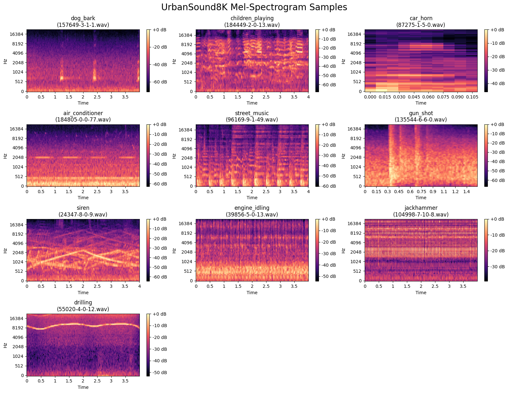

# Urban Sound Classification

## Project Overview 

This project aims to build a machine learning pipeline to classify 10+ categories of urban environmental sounds, such as traffic noise, sirens, birdsong, and construction noise, enabling smart-city monitoring and analysis of acoustic environments.

### Goals 

**Accurate Sound Recognition**: Build a model that can label environmental sounds with high accuracy.

### Data Collection 

[UrbanSound8K dataset](https://audeering.github.io/datasets/datasets/urbansound8k.html)  
Contains 8732 labeled sound clips (<=4s) across 10 urban classes.  

**Optional**: Sharing the final cleaned dataset on Kaggle or Hugging Face for reproducibility.

### Modeling

#### **Feature Extraction**

**Basic method**: Compute Mel-spectrograms.
**Optional**:  Apply data augmentation (time stretching, pitch shifting).

#### **Model Architectures**

**Baseline**: 2D CNN with batch norm and dropout.

**Optional**: Transfer learning using a pretrained audio model.

**Comparative Models**:

- Transfer learning using pretrained audio models (e.g., VGGish, YAMNet).
- AudioCLIP for inference-level benchmarking against the baseline.


### Visualization

**Basic visualization method**: Interactive confusion matrix.

**Additional planned visualizations**: 

- Precision-recall curves.
- t-SNE or PCA projections of learned representations.

- Per-class accuracy plots.


---

## Preliminary Visualizations of Data

### Class Distribution

*Figure 1: Distribution of sound classes in the UrbanSound8K dataset*

The dataset shows some class imbalance, with certain classes like "gun_shot" having fewer samples compared to others like "children_playing" and "dog_bark".

### Mel-Spectrogram Samples

*Figure 2: Sample Mel-spectrograms from each sound class*

**Key Observations:**
- `car_horn` shows strong horizontal harmonic lines
- `dog_bark` and `gun_shot` have transient, high-energy bursts
- `engine_idling` and `air_conditioner` contain stable low-frequency energy bands
- Each class exhibits distinct spectral patterns that can be learned by the model

## Detailed Description of Data Processing

We implemented a comprehensive preprocessing pipeline to convert raw audio files into standardized Mel-spectrogram representations:

### Data Processing Pipeline

| Step | Description | Parameters |
|------|-------------|------------|
| **1. Audio Loading** | Load audio files using `soundfile` for efficiency | - |
| **2. Resampling** | Standardize sampling rate (disabled, uses original SR) | `sample_rate=None` |
| **3. Mono Conversion** | Convert stereo to mono by averaging channels | - |
| **4. Mel-Spectrogram Extraction** | Transform waveform to log-Mel spectrogram | `n_mels=64`, `n_fft=1024`, `hop_length=512`, `fmax=8000` |
| **5. Normalization** | Min-max normalization to [0,1] range | Per-sample normalization |
| **6. Fixed Length** | Pad or crop to fixed time frames | `T=586` frames (≈4.0 seconds) |
| **7. Tensor Conversion** | Convert to PyTorch tensor format | `(1, n_mels, T)` |

### Key Processing Features
- **Fixed duration**: All audio clips standardized to 4 seconds
- **Consistent representation**: 64-bin Mel-spectrograms with 8kHz max frequency
- **Efficient loading**: Using `soundfile` for faster I/O operations
- **Memory optimization**: Dynamic tensor sizing based on configuration

## Detailed Description of Data Modeling Methods

### Model Architecture

We designed a compact **2D CNN** classifier to perform environmental sound classification on log-Mel spectrograms.  
The model progressively extracts local time–frequency patterns via convolutional layers and then maps them into class logits using a fully-connected classifier.

#### Architecture Overview

| Layer Type | Channels/Units | Kernel/Stride | Output Shape | Activation |
|------------|----------------|---------------|--------------|------------|
| **Input** | 1 × 64 × 586 | - | - | - |
| **Conv2d + BN + ReLU** | 1 → 16 | 3×3 / 1 | 16 × 64 × 586 | ReLU |
| **MaxPool2d** | - | 2×2 | 16 × 32 × 293 | - |
| **Conv2d + BN + ReLU** | 16 → 32 | 3×3 / 1 | 32 × 32 × 293 | ReLU |
| **MaxPool2d** | - | 2×2 | 32 × 16 × 146 | - |
| **Conv2d + BN + ReLU** | 32 → 64 | 3×3 / 1 | 64 × 16 × 146 | ReLU |
| **MaxPool2d** | - | 2×2 | 64 × 8 × 73 | - |
| **Flatten + Linear + Dropout** | 37,376 → 256 | - | 256 | ReLU + Dropout(0.3) |
| **Linear (Output)** | 256 → 10 | - | 10 | Softmax (via CrossEntropy) |

**Total Parameters**: ~0.47M (0.47 million)

This lightweight architecture strikes a balance between **training speed** and **representational power**, making it suitable for real-time or low-resource audio classification.

#### Training Configuration

| Hyperparameter | Value |
|----------------|-------|
| **Optimizer** | AdamW |
| **Learning Rate** | 1e-3 |
| **Weight Decay** | 1e-4 |
| **Scheduler** | CosineAnnealingLR |
| **Epochs** | 25 |
| **Batch Size** | 32 |
| **Loss Function** | CrossEntropyLoss |
| **Mixed Precision** | Enabled (`torch.cuda.amp`) |

#### Model Design Rationale
- **Lightweight**: Small parameter count for fast training and inference
- **Progressive downsampling**: Multiple pooling layers to capture hierarchical features
- **Batch normalization**: Stabilizes training and improves convergence
- **Dropout**: Prevents overfitting in the classifier head

## Preliminary Results

### Training Performance


*Figure 3: Training and validation loss/accuracy curves over 25 epochs*

**Training Observations:**
- **Training Loss**: Continuously decreases and stabilizes near 0.2
- **Validation Loss**: Oscillates around 1.3-1.5, indicating some overfitting
- **Training Accuracy**: Reaches ~94%
- **Validation Accuracy**: Plateaus around 72%
- **Convergence**: Model shows stable learning with proper convergence

### Test Set Performance

The model was evaluated on the official test split (fold 10) with the following results:

#### Overall Performance
- **Test Accuracy**: 63.6%
- **Macro Average F1-Score**: 67.9%
- **Weighted Average F1-Score**: 63.6%

#### Per-Class Performance

| Class | Precision | Recall | F1-Score | Support |
|-------|-----------|--------|----------|---------|
| air_conditioner | 0.88 | 0.64 | 0.74 | 100 |
| car_horn | 0.97 | 0.91 | 0.94 | 33 |
| children_playing | 0.45 | 0.71 | 0.55 | 100 |
| dog_bark | 0.76 | 0.68 | 0.72 | 100 |
| drilling | 0.41 | 0.80 | 0.54 | 100 |
| engine_idling | 0.75 | 0.63 | 0.69 | 93 |
| gun_shot | 1.00 | 0.97 | 0.98 | 32 |
| jackhammer | 0.41 | 0.18 | 0.25 | 96 |
| siren | 0.83 | 0.54 | 0.66 | 83 |
| street_music | 0.81 | 0.67 | 0.73 | 100 |

#### Confusion Matrix


*Figure 4: Confusion matrix showing classification results*

### Key Findings

**High-Performing Classes:**
- `gun_shot` (F1 = 0.98): Clear, distinctive sound signature
- `car_horn` (F1 = 0.94): Strong harmonic patterns
- `air_conditioner` (F1 = 0.74): Consistent low-frequency patterns

**Challenging Classes:**
- `jackhammer` (F1 = 0.25): High intra-class variation
- `children_playing` (F1 = 0.55): Overlaps with other classes
- `drilling` (F1 = 0.54): Similar to other mechanical sounds

**Common Misclassifications:**
- `children_playing` ↔ `street_music`: Shared background noise
- `engine_idling` ↔ `drilling`: Similar low-frequency characteristics
- `siren` ↔ `children_playing`: Harmonic overlaps

### Model Strengths and Limitations

**Strengths:**
- Efficient training with minimal parameters
- Good performance on distinctive sounds (gun_shot, car_horn)
- Stable convergence and learning

**Limitations:**
- Some overfitting (training accuracy > validation accuracy)
- Difficulty with similar-sounding classes
- Limited temporal context modeling

### Future Improvements

| Issue | Potential Solution |
|-------|-------------------|
| Overfitting | Data augmentation (SpecAugment, mixup) |
| Class confusion | Temporal modeling (CNN-LSTM, Transformer) |
| Limited context | Longer input windows or attention mechanisms |
| Class imbalance | Weighted loss or oversampling techniques |

## Next Steps

1. **Data Augmentation**: Implement SpecAugment and time masking
2. **Advanced Architectures**: Experiment with CNN-LSTM or Transformer models
3. **Transfer Learning**: Utilize pre-trained audio models (VGGish, YAMNet)
4. **Ensemble Methods**: Combine multiple models for improved performance
5. **Hyperparameter Tuning**: Systematic optimization of model parameters

## Files Structure

```
├── 2D_cnn.ipynb             # Baseline CNN implementation
├── data/                    # Dataset download scripts and data storage
│   ├── create.py
│   ├── download.py
│   ├── publish.py
│   └── requirements.txt     # Dependencies
└── plots/                   # Generated visualizations
    ├── class_distribution.png
    ├── mel_spectrogram_samples.png
    ├── training_curve.png
    └── confusion_matrix.png
```